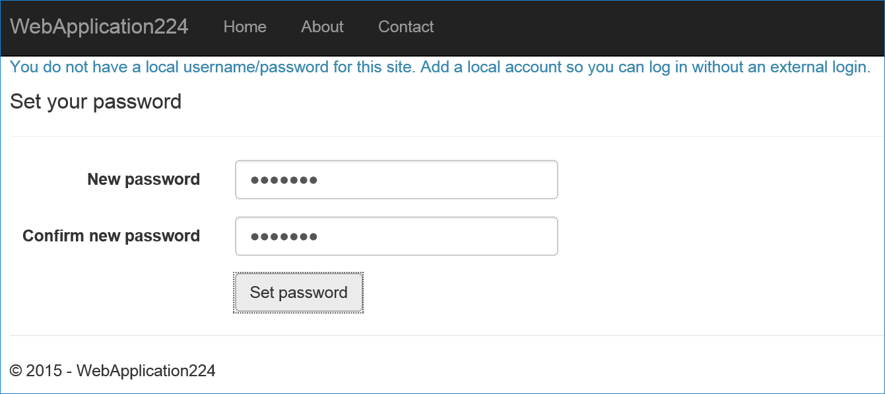

# Facebook, Google, and external provider authentication in ASP.NET Core

By [Valeriy Novytskyy](https://github.com/01binary) and [Rick Anderson](https://twitter.com/RickAndMSFT)

This tutorial demonstrates how to build an ASP.NET Core 2.x app that enables users to log in using OAuth 2.0 with credentials from external authentication providers.

[Facebook](xref:security/authentication/facebook-logins), [Twitter](xref:security/authentication/twitter-logins), [Google](xref:security/authentication/google-logins), and [Microsoft](xref:security/authentication/microsoft-logins) providers are covered in the following sections. Other providers are available in third-party packages such as [AspNet.Security.OAuth.Providers](https://github.com/aspnet-contrib/AspNet.Security.OAuth.Providers) and [AspNet.Security.OpenId.Providers](https://github.com/aspnet-contrib/AspNet.Security.OpenId.Providers).

Enabling users to sign in with their existing credentials is convenient for the users and shifts many of the complexities of managing the sign-in process onto a third party. For examples of how social logins can drive traffic and customer conversions, see case studies by [Facebook](https://www.facebook.com/unsupportedbrowser) and [Twitter](https://dev.twitter.com/resources/case-studies).

Note: Packages presented here abstract a great deal of complexity of the OAuth authentication flow, but understanding the details may become necessary when troubleshooting. Many resources are available; for example, see [Introduction to OAuth 2](https://www.digitalocean.com/community/tutorials/an-introduction-to-oauth-2) or [Understanding OAuth 2](http://www.bubblecode.net/2016/01/22/understanding-oauth2/). Some issues can be resolved by looking at the [ASP.NET Core source code for the provider packages](https://github.com/aspnet/Security/tree/master/src).

## Create a New ASP.NET Core Project

* In Visual Studio 2017, create a new project from the Start Page, or via **File > New > Project**.

* Select the **ASP.NET Core Web Application** template available in **Visual C# > .NET Core** category:

* Tap **Web Application** and verify **Authentication** is set to **Individual User Accounts**:

Note: This tutorial applies to ASP.NET Core 2.0 SDK version which can be selected at the top of the wizard.

## Apply migrations

* Run the app and select the **Log in** link.
* Select the **Register as a new user** link.
* Enter the email and password for the new account, and then select **Register**.
* Follow the instructions to apply migrations.

## Require SSL

OAuth 2.0 requires the use of SSL for authentication over the HTTPS protocol.

Note: Projects created using **Web Application** or **Web API** project templates for ASP.NET Core 2.x are automatically configured to enable SSL and launch with https URL if the **Individual User Accounts** option was selected on **Change Authentication dialog** in the project wizard as shown above.

* Require SSL on your site by following the steps in [Enforce SSL in an ASP.NET Core app](xref:security/enforcing-ssl) topic.

## Use SecretManager to store tokens assigned by login providers

Social login providers assign **Application Id** and **Application Secret** tokens during the registration process. The exact token names vary by provider. These tokens represent the credentials your app uses to access their API. The tokens constitute the "secrets" that can be linked to your app configuration with the help of [Secret Manager](xref:security/app-secrets#secret-manager). Secret Manager is a more secure alternative to storing the tokens in a configuration file, such as *appsettings.json*.

> [!IMPORTANT]
> Secret Manager is for development purposes only. You can store and protect Azure test and production secrets with the [Azure Key Vault configuration provider](xref:security/key-vault-configuration).

Follow the steps in [Safe storage of app secrets in development in ASP.NET Core](xref:security/app-secrets) topic to store tokens assigned by each login provider below.

## Setup login providers required by your application

Use the following topics to configure your application to use the respective providers:

* [Facebook](xref:security/authentication/facebook-logins) instructions
* [Twitter](xref:security/authentication/twitter-logins) instructions
* [Google](xref:security/authentication/google-logins) instructions
* [Microsoft](xref:security/authentication/microsoft-logins) instructions
* [Other provider](xref:security/authentication/otherlogins) instructions

[!INCLUDE]

## Optionally set password

When you register with an external login provider, you don't have a password registered with the app. This alleviates you from creating and remembering a password for the site, but it also makes you dependent on the external login provider. If the external login provider is unavailable, you won't be able to log in to the web site.

To create a password and sign in using your email that you set during the sign in process with external providers:

* Tap the **Hello &lt;email alias&gt;** link at the top right corner to navigate to the **Manage** view.

* Tap **Create**

* Set a valid password and you can use this to sign in with your email.

## Next steps

* This article introduced external authentication and explained the prerequisites required to add external logins to your ASP.NET Core app.

* Reference provider-specific pages to configure logins for the providers required by your app.

* You may want to persist additional data about the user and their access and refresh tokens. For more information, see <xref:security/authentication/social/additional-claims>.
