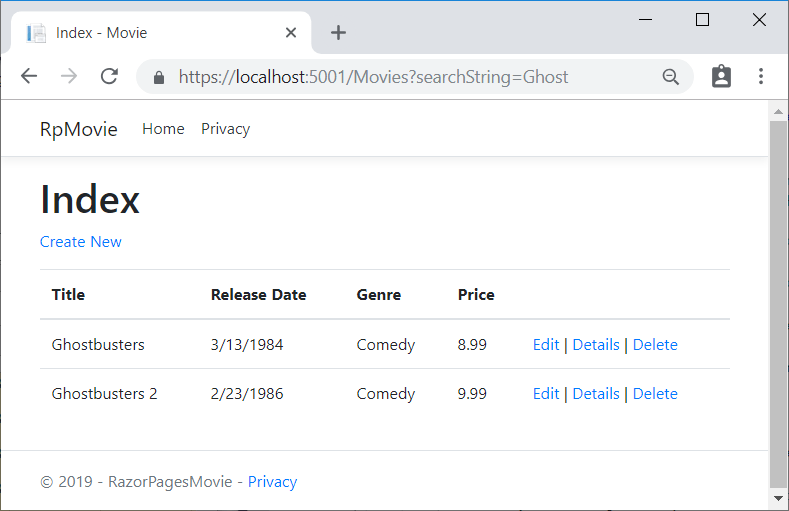
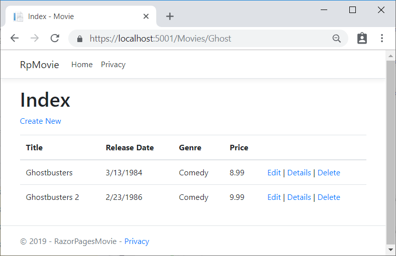

# Add search to ASP.NET Core Razor Pages

By [Rick Anderson](https://twitter.com/RickAndMSFT)

In this document, search capability is added to the Index page that enables searching movies by *genre* or *name*.

Update the Index page's `OnGetAsync` method with the following code:

[!code-csharp[](razor-pages-start/sample/RazorPagesMovie/Pages/Movies/Index.cshtml.cs?name=snippet_1stSearch)]

The first line of the `OnGetAsync` method creates a [LINQ](/dotnet/csharp/programming-guide/concepts/linq/) query to select the movies:

```csharp
var movies = from m in _context.Movie
             select m;
```

The query is *only* defined at this point, it has **not** been run against the database.

If the `searchString` parameter contains a string, the movies query is modified to filter on the search string:

[!code-csharp[](razor-pages-start/sample/RazorPagesMovie/Pages/Movies/Index.cshtml.cs?name=snippet_SearchNull)]

The `s => s.Title.Contains()` code is a [Lambda Expression](/dotnet/csharp/programming-guide/statements-expressions-operators/lambda-expressions). Lambdas are used in method-based [LINQ](/dotnet/csharp/programming-guide/concepts/linq/) queries as arguments to standard query operator methods such as the [Where](/dotnet/csharp/programming-guide/concepts/linq/query-syntax-and-method-syntax-in-linq) method or `Contains` (used in the preceding code). LINQ queries are not executed when they're defined or when they're modified by calling a method (such as `Where`, `Contains`  or `OrderBy`). Rather, query execution is deferred. That means the evaluation of an expression is delayed until its realized value is iterated over or the `ToListAsync` method is called. See [Query Execution](/dotnet/framework/data/adonet/ef/language-reference/query-execution) for more information.

**Note:** The [Contains](/dotnet/api/system.data.objects.dataclasses.entitycollection-1.contains) method is run on the database, not in the C# code. The case sensitivity on the query depends on the database and the collation. On SQL Server, `Contains` maps to [SQL LIKE](/sql/t-sql/language-elements/like-transact-sql), which is case insensitive. In SQLite, with the default collation, it's case sensitive.

Navigate to the Movies page and append a query string such as `?searchString=Ghost` to the URL (for example, `http://localhost:5000/Movies?searchString=Ghost`). The filtered movies are displayed.



If the following route template is added to the Index page, the search string can be passed as a URL segment (for example, `http://localhost:5000/Movies/Ghost`).

```cshtml
@page "{searchString?}"
```

The preceding route constraint allows searching the title as route data (a URL segment) instead of as a query string value.  The `?` in `"{searchString?}"` means this is an optional route parameter.



However, you can't expect users to modify the URL to search for a movie. In this step, UI is added to filter movies. If you added the route constraint `"{searchString?}"`, remove it.

Open the *Pages/Movies/Index.cshtml* file, and add the `<form>` markup highlighted in the following code:

[!code-cshtml[](razor-pages-start/sample/RazorPagesMovie/Pages/Movies/Index2.cshtml?highlight=14-19&range=1-22)]

The HTML `<form>` tag uses the [Form Tag Helper](xref:mvc/views/working-with-forms#the-form-tag-helper). When the form is submitted, the filter string is sent to the *Pages/Movies/Index* page. Save the changes and test the filter.


## Search by genre

Add the following highlighted properties to *Pages/Movies/Index.cshtml.cs*:

::: moniker range="= aspnetcore-2.0"

[!code-csharp[](razor-pages-start/sample/RazorPagesMovie/Pages/Movies/Index.cshtml.cs?name=snippet_newProps&highlight=11-999)]

::: moniker-end

::: moniker range=">= aspnetcore-2.1"

[!code-csharp[](razor-pages-start/sample/RazorPagesMovie21/Pages/Movies/Index.cshtml.cs?name=snippet_newProps&highlight=11-999)]

::: moniker-end


The `SelectList Genres` contains the list of genres. This allows the user to select a genre from the list.

The `MovieGenre` property contains the specific genre the user selects (for example, "Western").

Update the `OnGetAsync` method with the following code:

[!code-csharp[](razor-pages-start/sample/RazorPagesMovie/Pages/Movies/Index.cshtml.cs?name=snippet_SearchGenre)]

The following code is a LINQ query that retrieves all the genres from the database.

[!code-csharp[](razor-pages-start/sample/RazorPagesMovie/Pages/Movies/Index.cshtml.cs?name=snippet_LINQ)]

The `SelectList` of genres is created by projecting the distinct genres.

<!-- BUG in OPS
Tag snippet_selectlist's start line '75' should be less than end line '29' when resolving "[!code-csharp[](razor-pages-start/sample/RazorPagesMovie/Pages/Movies/Index.cshtml.cs?name=snippet_SelectList)]"

There's no start line.

[!code-csharp[](razor-pages-start/sample/RazorPagesMovie/Pages/Movies/Index.cshtml.cs?name=snippet_SelectList)]
-->

```csharp
Genres = new SelectList(await genreQuery.Distinct().ToListAsync());
```

### Adding search by genre

Update *Index.cshtml* as follows:

[!code-cshtml[](razor-pages-start/sample/RazorPagesMovie/Pages/Movies/IndexFormGenreNoRating.cshtml?highlight=16-18&range=1-26)]

Test the app by searching by genre, by movie title, and by both.

> [!div class="step-by-step"]
> [Previous: Updating the pages](xref:tutorials/razor-pages/da1)
> [Next: Adding a new field](xref:tutorials/razor-pages/new-field)
